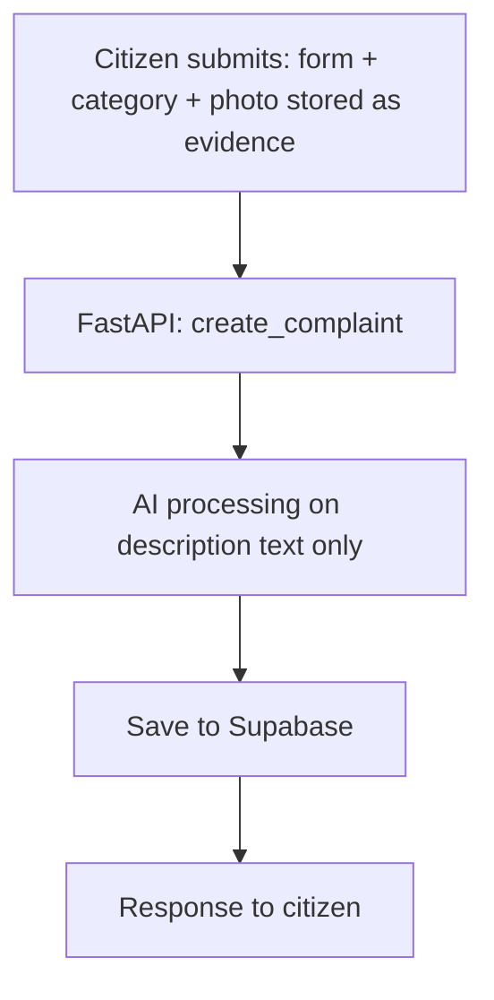
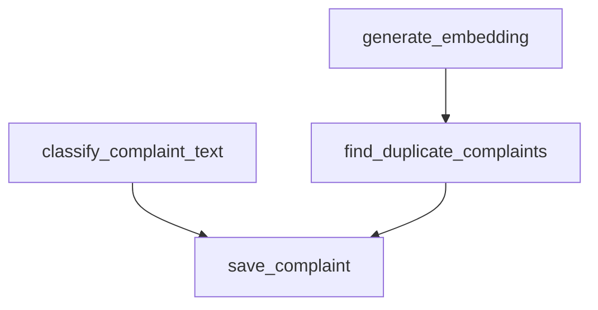
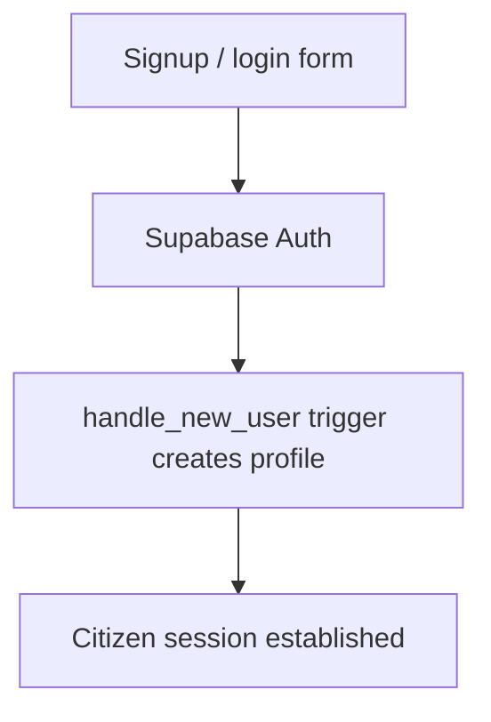

# Citizen flow — architecture & function map

## Layers
```
Next.js (citizen UI)
   |  fetch()
   v
FastAPI (backend/app/routers/citizen.py)
   |
   +-- Supabase Auth (session validation)
   +-- AI pipeline (nlp.py, embeddings.py)
   +-- Supabase Postgres + Storage (via supabase-py client)
```

## Function inventory — citizen scope
| File | Function | Responsibility |
|---|---|---|
| `apps/citizen/lib/api.ts` | `submitComplaint(data)` | POSTs form data to `/complaints`, handles multipart image |
| `apps/citizen/lib/auth.ts` | `signUp()`, `signIn()`, `signOut()` | Wraps the Supabase Auth JS client |
| `backend/app/routers/citizen.py` | `create_complaint()` | Orchestrates the full submission pipeline |
| `backend/app/routers/citizen.py` | `list_my_complaints()` | Returns complaints for `auth.uid()` |
| `backend/app/routers/citizen.py` | `get_complaint()` | Returns one complaint + status history |
| `backend/app/services/nlp.py` | `classify_complaint_text(text)` | Returns severity and summary |
| `backend/app/services/embeddings.py` | `generate_embedding(text)` | Returns a 384-dim vector |
| `backend/app/services/embeddings.py` | `find_duplicate_complaints(embedding)` | pgvector cosine search, candidates above threshold |
| `backend/app/services/storage.py` | `upload_complaint_image(file, complaint_id)` | Uploads to Supabase Storage, returns URL |
| `backend/app/services/db.py` | `save_complaint(...)` | Inserts into `complaints`, `complaint_images`, `complaint_status_history` |

Every function above must follow `docs/LOGGING.md`.

## Flow 1 — submission pipeline (overview)


## Flow 2 — AI processing detail


## Flow 3 — auth


## Design notes
- NLP and embedding generation are independent of each other — run them
  concurrently with `asyncio.gather` where practical. Only duplicate detection depends on
  the embedding being ready first.
- If `find_duplicate_complaints()` returns a candidate above the similarity threshold
  (start at cosine similarity >= 0.87, tune once real data exists), set
  `status = 'duplicate'` and `duplicate_of_complaint_id`, but still save the complaint —
  never silently drop a citizen's report.
- Category is supplied directly by the citizen at submission — there is no AI fallback or override for category.
